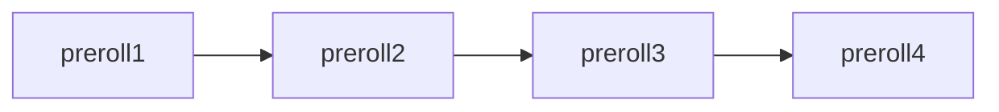
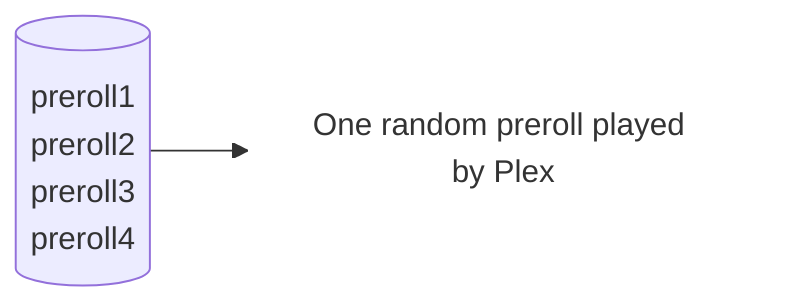
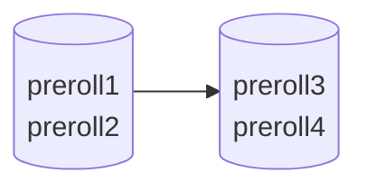
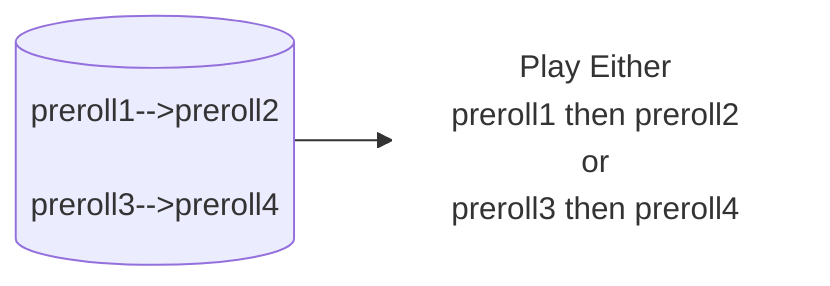
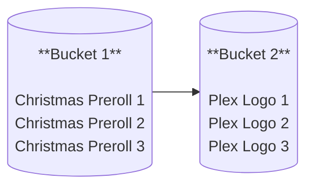

### What is Preroll Plus?

Preroll Plus is a smart preroll scheduler for Plex that overcomes the platform’s limited ","/";" syntax for mixing random and sequential prerolls.

Using Plex webhooks it rewrites the preroll string each time a movie starts, letting you keep ordered sets while still randomizing their contents – and it can also rotate prerolls automatically on a daily/weekly schedule.

Preroll Plus focuses on doing one thing and doing it efficiently with no extra bloat.

### What Problem Does This Solve?

Taken directly from Plex's preroll configuration:

>Enter the full path to the pre-roll video file. If multiple paths separated by commas are entered, videos will be played sequentially.If multiple paths separated by semi-colons are used, a single pre-roll video will be chosen randomly from the list.

Plex only offers two choices here...play a static sequence of preroll files, or choose one random preroll from the list. There is no option or ability to combine these two ideas together. That's where Preroll Plus steps in!

To visualize this, here is an example of a preroll sequence using commas to separate the video files:

```
preroll1,preroll2,preroll3,preroll4
```



Now here is an example of choosing a random video file using semi-colons:


```
preroll1;preroll2;preroll3;preroll4
```



One random preroll is chosen and played once.

What you cannot do:

```
preroll1;preroll2,preroll3;preroll4

preroll1,preroll2;preroll3,preroll4
```

The intention for line one would be to play either preroll1 or preroll2 randomly, then after that play either preroll3 or preroll4 randomly.


The intention for line 2 would be to randomly select the preroll1-->preroll2 sequence, or the preroll3-->preroll4 sequence.



### The Solution

Preroll Plus solves this problem by generating a comma-delimited sequence string (since it is the only way to play multiple prerolls in one session), but does the randomization internally before creating the final sequence that is sent to Plex.

This is accomplish by the user creating buckets that contain sets of files, and then creating sequences using these buckets to generate a custom built preroll list. Buckets act like mini-lists: randomize inside, chain sequentially between them.

Here is an example:

#### Christmas Sequence



In this scenario, a random preroll from Bucket 1 will be played, and then a random preroll from Bucket 2 will be played. You can chain as many buckets together as you want.


### Getting Started

- [Installation](category/Installation)
- [Configuration](category/Configuration)
- [Reference](category/Reference)
